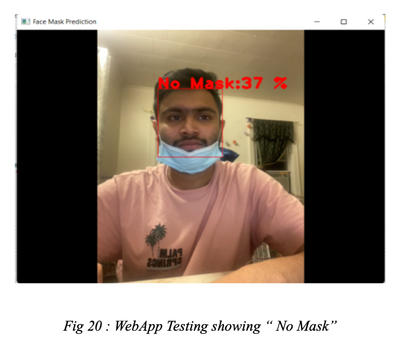
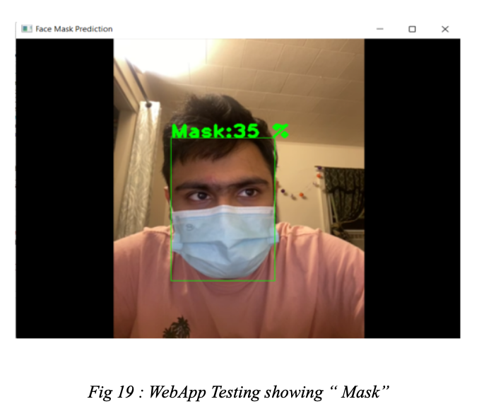
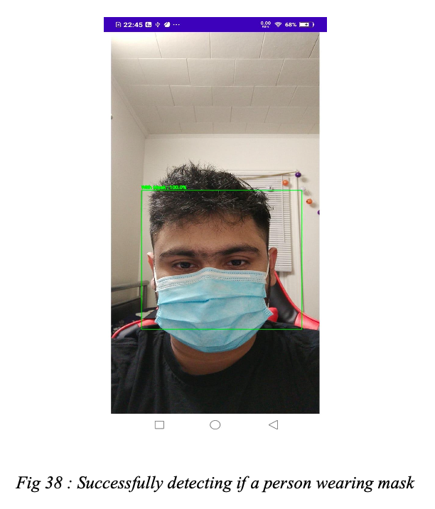
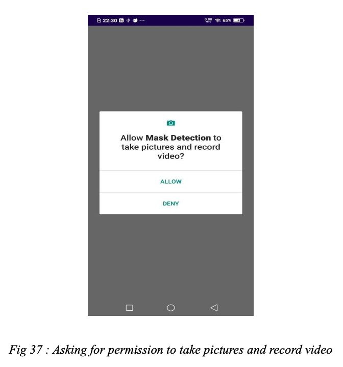
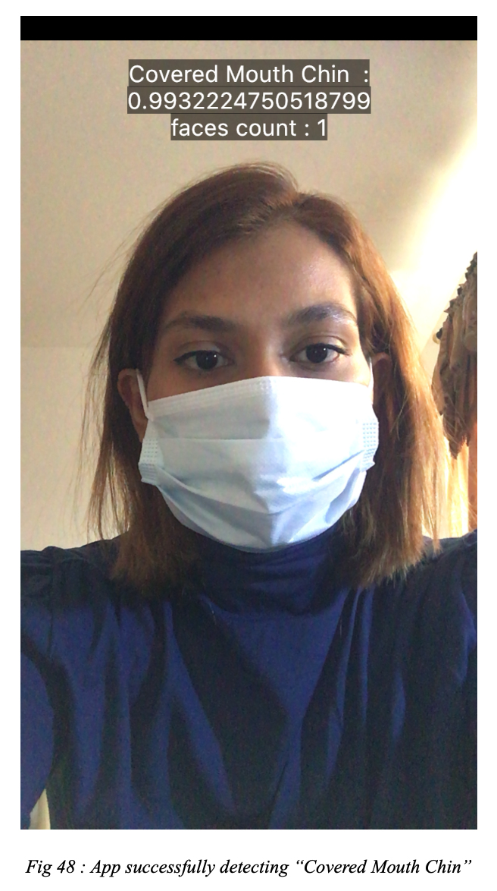
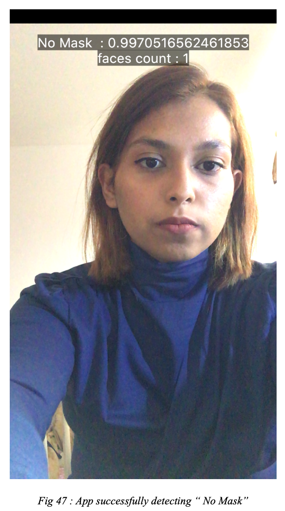

# Face Mask Detection

> **CV / MULTI-CLIENT SYSTEM**  
> Real-time face detection · Four-class mask classification · Desktop + Android + Flutter/iOS

A multi-platform computer-vision project for detecting faces and classifying mask usage from live camera input.

The system was developed during the COVID-19 era as an exploration of deploying the same classification concept across three client environments: a Python desktop application, a native Android application, and a Flutter-based mobile application targeting iOS.

The public version focuses on **local inference**. Remote logging integrations and credential-dependent services are not required.

---

## SYSTEM DOSSIER

| | |
| --- | --- |
| **Task** | Face detection + mask-status classification |
| **Classes** | 4 |
| **Clients** | Desktop · Android · Flutter/iOS |
| **Desktop inference** | TensorFlow / Keras |
| **Android inference** | TensorFlow Lite |
| **Flutter inference** | TensorFlow Lite |
| **Face detection** | OpenCV DNN · Google Vision · ML Kit |
| **Input** | Camera / video frames |
| **Output** | Bounding box · predicted class · confidence |
| **Execution model** | Local inference |

---

# 01 / PROBLEM

Binary mask detection can distinguish between a person wearing or not wearing a mask, but incorrect mask placement also matters.

This project therefore uses four mask-status classes:

```text
MASK
NO MASK
COVERED MOUTH CHIN
COVERED NOSE MOUTH
```

The goal was to build a reusable detection workflow and explore how that workflow could be adapted across desktop and mobile clients.

---

# 02 / SYSTEM ARCHITECTURE

```text
                           CAMERA / VIDEO
                                │
                                ▼
                      ┌───────────────────┐
                      │   FRAME CAPTURE   │
                      └─────────┬─────────┘
                                │
                                ▼
                      ┌───────────────────┐
                      │  FACE DETECTION   │
                      └─────────┬─────────┘
                                │
                                ▼
                         FACE REGION / ROI
                                │
                                ▼
                      ┌───────────────────┐
                      │   PREPROCESSING   │
                      │ resize · normalize│
                      └─────────┬─────────┘
                                │
                                ▼
                      ┌───────────────────┐
                      │ MASK CLASSIFIER   │
                      │                   │
                      │ Mask              │
                      │ No Mask           │
                      │ Covered Mouth     │
                      │ Covered Nose      │
                      └─────────┬─────────┘
                                │
                                ▼
                    CLASS + CONFIDENCE + BOX
                                │
              ┌─────────────────┼─────────────────┐
              │                 │                 │
              ▼                 ▼                 ▼
        ┌───────────┐     ┌───────────┐     ┌───────────┐
        │  DESKTOP  │     │  ANDROID  │     │  FLUTTER  │
        │           │     │           │     │   / iOS   │
        │ Python    │     │ Kotlin    │     │ Dart      │
        │ PyQt5     │     │ TFLite    │     │ TFLite    │
        │ OpenCV    │     │ Vision    │     │ ML Kit    │
        └───────────┘     └───────────┘     └───────────┘
```

Although each client uses a different application stack, they follow the same high-level pattern:

```text
DETECT → CROP → PREPROCESS → CLASSIFY → DISPLAY
```

---

# 03 / CLASSIFICATION FIELD

The classifier distinguishes among four states:

| Class | Interpretation |
| --- | --- |
| **Mask** | Mask detected |
| **No Mask** | No mask detected |
| **Covered Mouth Chin** | Mask placement does not correctly cover the required facial area |
| **Covered Nose Mouth** | Alternate partial-covering state represented by the model |

The applications display the predicted class together with model confidence.

No benchmark accuracy or latency numbers are reported here because the repository does not contain a verified evaluation artifact supporting those claims.

---

# 04 / DESKTOP CLIENT

**Stack**

```text
Python
PyQt5
OpenCV
TensorFlow / Keras
NumPy
SciPy
```

The desktop application captures frames from the local camera through OpenCV.

For each frame:

```text
FRAME
  │
  ▼
OPEN-CV FACE DETECTOR
  │
  ▼
FACE CROP
  │
  ▼
100 × 100 PREPROCESSING
  │
  ▼
KERAS CLASSIFIER
  │
  ▼
SOFTMAX PROBABILITY
  │
  ▼
BOUNDING BOX + LABEL
```

The face-detection stage uses OpenCV's DNN interface with the ResNet SSD face detector configuration.

The detected facial region is then normalized and passed to the TensorFlow/Keras mask classifier.

### Desktop interface

<p align="center">
  
  
</p>

> Earlier project documentation referred to this component as a web application. The implementation is actually a **Python/PyQt desktop client**.

---

# 05 / ANDROID CLIENT

**Stack**

```text
Kotlin
Android CameraView
Google Mobile Vision FaceDetector
TensorFlow Lite
TensorFlow Lite Support
GPU Delegate
```

The Android client processes live camera frames and performs inference locally.

```text
CAMERA FRAME
     │
     ▼
BITMAP CONVERSION
     │
     ▼
FACE DETECTION
     │
     ▼
FACE CROP
     │
     ▼
RESIZE + NORMALIZE
     │
     ▼
TENSORFLOW LITE
     │
     ▼
CLASS PROBABILITIES
     │
     ▼
OVERLAY + CONFIDENCE
```

The application checks whether a TensorFlow Lite GPU delegate is supported by the device.

When available:

```text
GPU DELEGATE
```

Otherwise the interpreter falls back to:

```text
CPU / 4 THREADS
```

This keeps inference on the device without requiring a remote classification service.

### Android interface

<p align="center">
  
  
</p>

---

# 06 / FLUTTER + iOS CLIENT

**Stack**

```text
Dart
Flutter
Camera
Google ML Kit Face Detection
TensorFlow Lite
```

The Flutter client uses the front-facing camera to stream image frames.

ML Kit identifies faces in the camera input, while the TensorFlow Lite model performs mask classification.

```text
FRONT CAMERA
     │
     ▼
IMAGE STREAM
     │
     ▼
ML KIT FACE DETECTION
     │
     ▼
TFLITE INFERENCE
     │
     ▼
SORT CLASS CONFIDENCE
     │
     ▼
DISPLAY RESULT + FACE COUNT
```

The repository contains Flutter application code together with its native iOS runner structure.

### Flutter / iOS interface

<p align="center">
  
  
</p>

---

# 07 / PLATFORM COMPARISON

| Client | Interface | Face Detection | Classification |
| --- | --- | --- | --- |
| **Desktop** | PyQt5 | OpenCV DNN | TensorFlow / Keras |
| **Android** | Native Kotlin | Google Mobile Vision | TensorFlow Lite |
| **Flutter / iOS** | Flutter | Google ML Kit | TensorFlow Lite |

The project is useful as a deployment study because the application layer changes while the computer-vision workflow remains conceptually consistent.

---

# 08 / INFERENCE PIPELINE

```text
01
FRAME ACQUISITION
camera / video input

        │
        ▼

02
FACE LOCALIZATION
identify candidate face regions

        │
        ▼

03
REGION EXTRACTION
crop detected face

        │
        ▼

04
PREPROCESSING
resize · normalize · tensor conversion

        │
        ▼

05
CLASSIFICATION
run neural-network inference

        │
        ▼

06
POSTPROCESSING
select highest-confidence class

        │
        ▼

07
PRESENTATION
bounding box · label · confidence
```

---

# 09 / LOCAL-FIRST PUBLIC VERSION

The current public repository intentionally uses a simpler deployment boundary:

```text
CAMERA
   │
   ▼
LOCAL FACE DETECTION
   │
   ▼
LOCAL MODEL INFERENCE
   │
   ▼
LOCAL RESULT
```

No remote detection-log service is required by the current public clients.

This keeps the repository focused on the computer-vision workflow itself and avoids coupling inference to external infrastructure.

---

# 10 / MODEL ARTIFACTS

Some trained model binaries are intentionally **not distributed in this public repository**.

The source code expects model artifacts such as:

```text
Desktop
├── OpenCV face-detector weights
└── complete TensorFlow / Keras SavedModel weights

Android
└── model_v2.tflite

Flutter / iOS
└── model_v2.tflite
```

The label files remain in the repository so the intended class mapping is preserved.

For the desktop OpenCV face detector, the repository also retains a reference URL for obtaining the corresponding public OpenCV model weights.

Because the model binaries are not fully included, the repository should be treated primarily as a **source-code and system-design record** unless the required trained artifacts are supplied locally.

---

# 11 / REPOSITORY MAP

```text
FaceMaskDetection/
│
├── Desktop/
│   └── source/
│       ├── app.py
│       ├── deeplearning.py
│       ├── face_cnn_model/
│       └── models/
│
├── Android/
│   └── MaskDetection/
│       └── app/
│           └── src/main/
│               ├── java/
│               ├── res/
│               └── assets/
│
├── iOS/
│   └── Face_mask_detection/
│       ├── lib/
│       ├── ios/
│       ├── android/
│       └── assets/
│
├── faceWebone.png
├── faceWebTwo.png
├── faceAndroidone.png
├── faceAndroidTwo.png
├── faceiOSone.png
├── faceiOStwo.png
│
└── README.md
```

---

# 12 / TECHNICAL THEMES

The project brings together several areas of applied ML engineering:

```text
COMPUTER VISION
      │
      ├── frame processing
      ├── face localization
      └── image classification
      │
MODEL DEPLOYMENT
      │
      ├── TensorFlow
      ├── TensorFlow Lite
      └── device-specific inference
      │
APPLICATION ENGINEERING
      │
      ├── Python desktop UI
      ├── native Android
      └── Flutter mobile
      │
SYSTEM DESIGN
      │
      └── one ML task across multiple clients
```

The most important design lesson is not any single framework.

It is the separation between:

```text
INPUT
↓
PERCEPTION
↓
PREPROCESSING
↓
INFERENCE
↓
PRESENTATION
```

That structure can be preserved even when the application platform changes completely.

---

# 13 / PROJECT SCOPE

This repository preserves an academic/team computer-vision application built around mask-use classification during the COVID-19 period.

It should not be interpreted as a production safety, medical, identity-recognition, or access-control system.

The project demonstrates:

- face-region detection from live camera input
- four-class image classification
- model inference on desktop and mobile clients
- TensorFlow-to-TensorFlow-Lite deployment patterns
- mobile GPU delegation
- camera-frame preprocessing
- prediction overlays and confidence display
- cross-platform application design

---

# 14 / TEAM

Developed by:

**Farnaz Zinnah**  
**Afia Nawar Jenice**  
**Shashwata Kayum**  
**Ahmed Nafis**  
**Humaira Syed**  
**Juhi Rahman**

---

<div align="center">

### FACE MASK DETECTION

**COMPUTER VISION / MULTI-CLIENT INFERENCE**

`DESKTOP · ANDROID · FLUTTER / iOS`

</div>
